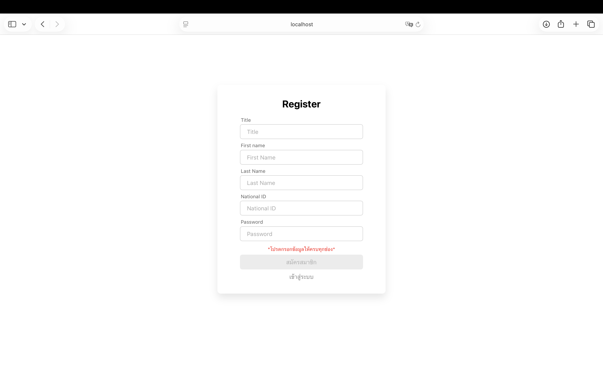
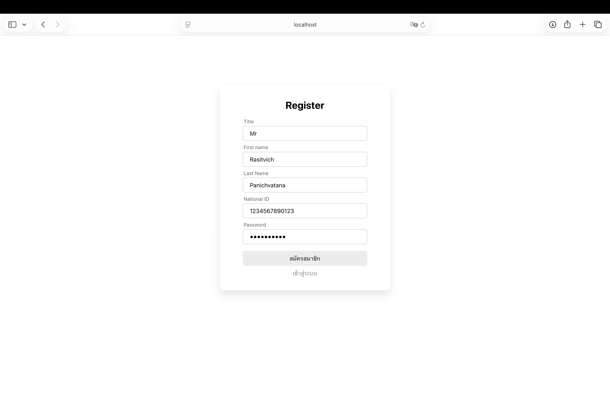
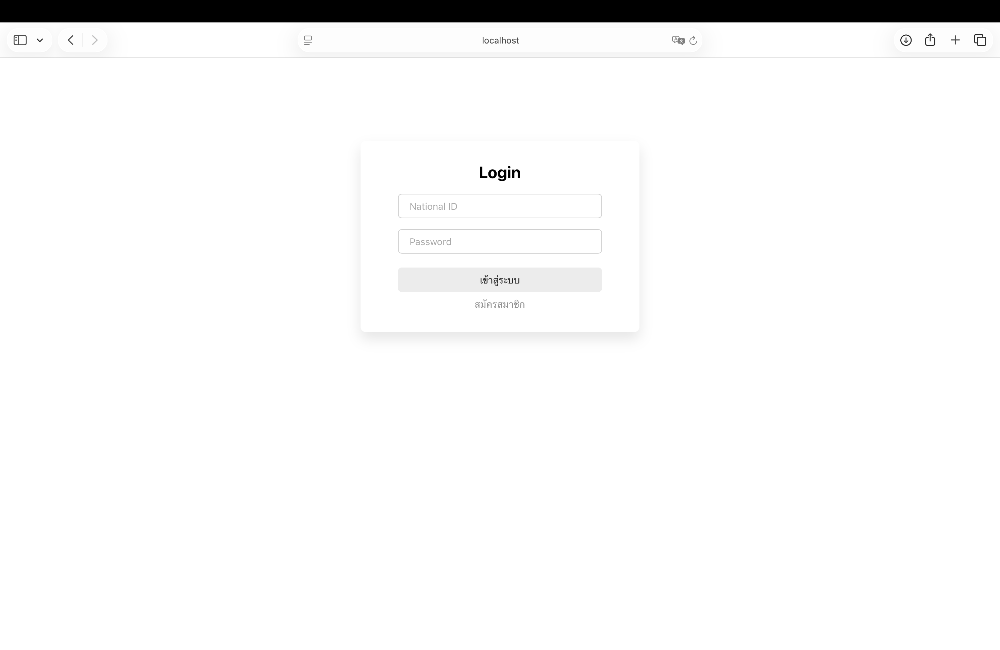
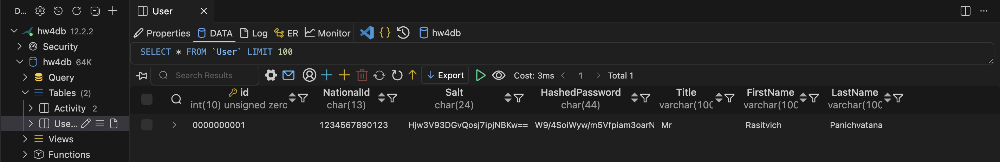

# Introduction to Mobile Computing

Assignments for 2301466 Introduction to Mobile Computing

Tools: React(JS) + .NET (C#) + Maria DB + Material UI (MUI)

## Final Project

- Register and Login system with Hash Password and Salt
  - Register Page
    
  - Filled
    
  - Login Page
    
  - Plaintext Password = 123
    

- Activity Board and Credit Page
  - Add / Edit / Remove
